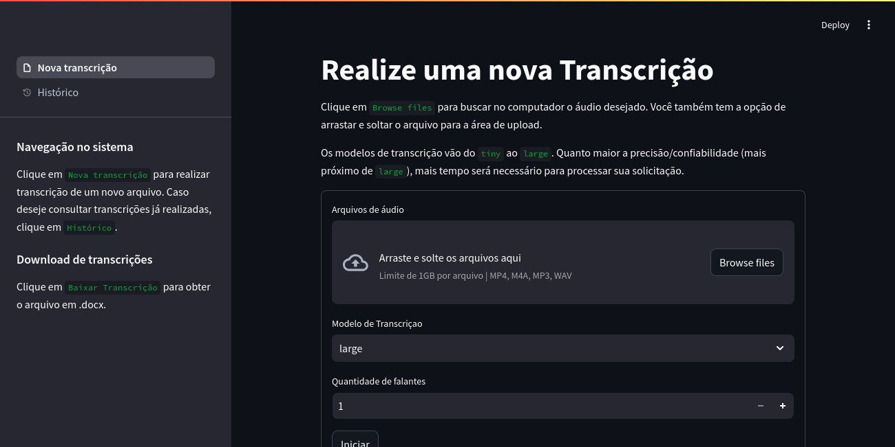

<h1 align="center"> Dashboard para transcrição de áudio </h1>

<!-- pasta para o git conseguir acessar a foto -->
<p align="center">
  
</p>

## 🎯 Projetos base
- https://github.com/jojojaeger/whisper-streamlit
- https://medium.com/@xriteshsharmax/speaker-diarization-using-whisper-asr-and-pyannote-f0141c85d59a

  
## 🚀 Tecnologias
- Streamlit: framework open source usado para transformar scripts Pyhton em aplicações web. 
- [Whisper - OpenAI](https://github.com/openai/whisper): modelo de reconhecimento automático de fala desenvolvido pela OpenAI. Processa áudio e gera saída de texto. 
- [AgglomerativeClustering](https://scikit-learn.org/dev/modules/generated/sklearn.cluster.AgglomerativeClustering.html): algoritmo de aprendizado não supervisionado, utilizado aqui para a identificação e separação de diferentes vozes em um áudio. 

## ▶️ Fluxograma de funcionamento do sistema
- [Desenho do algoritmo](https://www.mermaidchart.com/raw/e361f51c-36c1-4215-ae15-dea2c0fba48a?theme=light&version=v0.1&format=svg)
  
# Configurações do ambiente de desenvolvimento
1. Clone o projeto.
```
git clone git@github.com:cibellemc/speech-to-text.git
```

2. Entre na pasta do projeto
```
cd/speech-to-text
```

3. Faça o build da imagem (Dockerfile)
```
sudo docker build -t speech-to-text:1.0 .
```

4. Suba os containers (docker-compose.yaml)
```
sudo docker-compose up -d
```

Caso queira mudar configurações de portas, nome de banco de dados ou senha, ou nome dos containers, edite os arquivos `.streamlit/secrets.toml` e `docker-compose.yaml`.

## 🌐 Acesso à aplicação
No terminal em que você subiu o docker-compose aparecerá o link de acesso
```
# exemplo 
teste-docker-app-1       |   You can now view your Streamlit app in your browser.
teste-docker-app-1       | 
teste-docker-app-1       |   Local URL: http://0.0.0.0:8501
```

Você pode acessar localmente (127.0.0.1:8501), dentro da rede ou externamente (consultar seus ips e manter a porta 8501)
